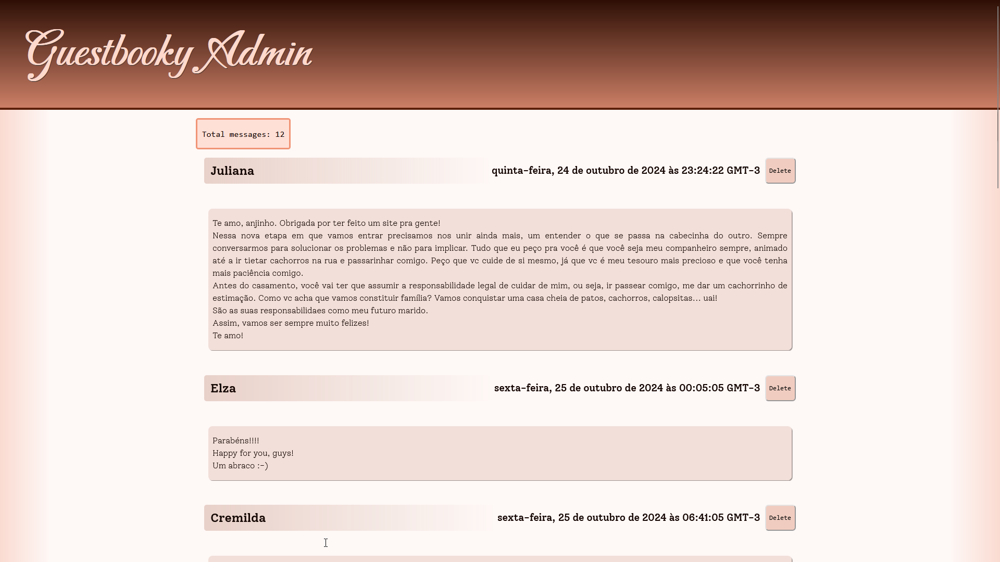

  

<h3 align="center">Guestbooky</h3>

---

A simple yet somehow overdesigned guestbook system featuring a simple control panel

 This is phase I of the personal backscratchers project.

## 📝 Table of Contents

- [📝 Table of Contents](#-table-of-contents)
- [🧐 About ](#-about-)
- [📑 Documentation ](#-documentation-)
- [🏁 Getting Started ](#-getting-started-)
- [🕸️ Prerequisites](#️-prerequisites)
  - [Backend](#backend)
  - [Admin panel](#admin-panel)
- [🚀 Deployment ](#-deployment-)
  - [Backend](#backend-1)
  - [Admin Panel](#admin-panel-1)
  - [Backup](#backup)
- [⛏️ Built Using ](#️-built-using-)
- [✍️ Authors ](#️-authors-)

## 🧐 About 

Guestbooky proposes something slightly deviating from the usual guestbook taken from 1998: while we gladly accept your messages, thank you very much, reading them is limited to the receiver. *I mean, of course they can show them to others should they want-*

That means it is something useful for engaged couples and other folks with a moment or two to set everything up. I really need to get my hands dirty from time to time, so I figured I'd make a guestbook for my marriage hotsite. And make everyone else see this code.

It includes many concepts that are very reasonable to tinker with as learning material, in a bite-sized project complexity that allows me to talk about it without losing the breadcrumb trail.

## 📑 Documentation 

[Comments and general documentation/musings on the project](docs/comments.md)

## 🏁 Getting Started 

These instructions will get you a copy of the project up and running on your local machine for development and testing purposes. See [deployment](#deployment) for notes on how to deploy the project on a live system.

## 🕸️ Prerequisites

### Backend

For running it locally:
- .NET 8.0
- A running instance of MongoDB
- A Cloudflare turnstile secret key for the captcha
- Not forgetting to set up environment variables

There's a `.env.template` file with all environment variables used throughout the compose file.

> [!IMPORTANT]
 You will need to set them up either by hand or by using your IDE's capabilities. On Visual Studio, that can be done via the Debug Properties of Guestbooky.API.

|Env Variable Keys|Usage|
|----|----|
|**CORS_ORIGINS**, **ACCESS_\***|Variables related to JWT issuing and checking. In order to use the GET and DELETE endpoints for the messages, you need to use a bearer token.|
|**CLOUDFLARE_SECRET**|The turnstile secret, used in the server portion of the captcha check.|
|**MONGODB_\***|Related to the connection to MongoDB. Yeah.|
|**LOG_\***|Logging.|
|**GUESTBOOKY_**|Related to accessing the main document collection, which uses its own user.|

> [!TIP]
> For local usage of the backend, you can use `docker-compose.local.yml` which provides just what you need to run the backend yourself.

### Admin panel

The admin panel is a simple React app built through Vite.

If you haven't done so, the prerequisites are:

- Node v18+
- NPM or any other package manager
- Vite

Using [nvm](https://github.com/nvm-sh/nvm) should make things straightforward enough for your environment if you don't have Node up yet. Then do the usual `npm i` (or equivalent) in the Admin Panel's `src/Guestbooky-admin` folder and such to get the packages, which should include Vite.

For development, it should be enough to run `vite` in Guestbooky-admin's `src` folder.

## 🚀 Deployment 

### Backend

Use `docker-compose.public.yml` as a basis, and remember to have a `.env` file ready. it should create the image for you and start running.

### Admin Panel

In order to create a live version, adjust the **API_URL** path in `Guestbooky-admin/src/environment/constants.js`, and execute `vite build`. The application will be prepared and sent to `src/Guestbooky-admin/dist`. Send to your hosting solution and you should be good.

### Backup

Mongodump is run as a cron job daily. The behavior is customizable in `docker-compose.yml`

## ⛏️ Built Using 

- [MongoDB](https://www.mongodb.com/) - Database
- [.NET](https://dot.net/) - Backend
- [React](https://react.dev/)/[Vite](https://vite.dev) - Admin Panel
- [Cloudflare Turnstile](https://www.cloudflare.com/pt-br/products/turnstile/) - Captcha

## ✍️ Authors 

- [@cotti](https://github.com/cotti) | [cotti.com.br](https://cotti.com.br)