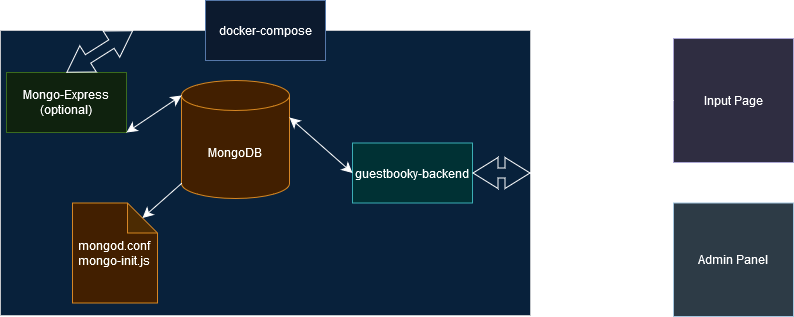

# General Comments

Oh, hello. In this document, I'll write down some impressions and musings from the development of this project.

## Concept

`Guestbooky` works by exposing just a port belonging to the backend. Optionally, `mongo-express` can be built and exposed as well in order to allow direct control of the data.

Unlike most guestbook systems made since the 90s, `Guestbooky` allows sending messages but only the owner is capable of seeing them. Its credentials are set up via the `docker-compose` file itself, since it's meant to be run in a simple-ish way.

In theory, this model is suitable for people receiving messages that pertains much more to them than the general public, such as engagements, weddings and the such. It can be a way to gather these and reuse them in another context, like a video during the ceremony and whatnot. 

Clearly, I built this thinking of my own circumstances at the moment. I'd love to see it being useful for someone else too, either as the application itself or learning material. 

___

## Architectural musings

- I have attempted to keep this as close to something *domain-driven* would. The main issue though is that the domain itself here is rather anemic. There isn't much to do outside of **auth & CRUD**. It's not even CRUD - *no updates*!

- It uses *Clean Architecture* - or at least my current best understanding of it at the moment.
  - The domain layer turned out to contain only interfaces to things to be implemented in the Infrastructure Layer. 
  - Being an infrastructure-heavy API, the application layer didn't have much to do besides some Application-level validation.
  - I decided to lean heavily on *DTOs* between layers for the requests and responses. They feel a bit too much for this at times, but it is still enjoyable to have very defined contracts.

- It uses `Mediatr`, which simplifies the calls to the application layer immensely - once the necessary scaffolding is implemented.

- Technically one can say Queries and Commands are not touching each other, but I'm not sure on the idea of it being *CQRS* if there isn't a clear use of it - such as actually different databases handling each further down the pipeline.

- The more I worked on it, the more I noticed how *Vertical Slice architecture* would be a much better way to work in it. It seems to be very, very good at handling situations like APIs that performed well-defined, concise operations. The way I worked on this project was by building each functionality from one side to the other, filling the piping gaps inbetween. It would have been much easier with vertical slicing! Except handling the common structural code. It is a little bit of an *L-shaped architecture* specially at the beginning. 

- It uses a pretty sub-optimal way to handle *Refresh Tokens*. I have added it because I was curious, but it is not what one should go for in production code.

- `GET /messages` is a pretty fun endpoint. I went digging for good ways to be *RESTful*, and abide to *RFCs* where I could. Turns out there isn't too much of a consensus in practice, even though there's a lot of nodding approving certain practices.
  - It was pretty tricky to reconcile using a *DTO* abstraction as input with metadata in the request header, **AND** provide some kind of feedback that it is needed in *Swagger*, **AND** have decent model validation. It works, but I could work some more on this later.
  - I think the general recommended mechanism (*the* `range` *header*) is neat, but it is rather cumbersome, and I wouldn't be much against not using it in custom internal projects.

- The application layer ended up being a showcase for having some custom *Mediatr* behavior. After it was implemented, it made more sense, but I really think a class like my implementation of `ValidationBehavior` needs to be a default. Unless it is and I really didn't see it.

- There isn't much exception handling, except in the API layer. This is on purpose. Another thing that this project could really use, but is left as an exercise, is using a `Maybe<T>/Result<T>/ErrorOr<T>` type.
  - Since there is so little that can go wrong with *low-stakes CRUDding*, it is a reasonable trade-off to let the API layer catch and send an internal server error.

